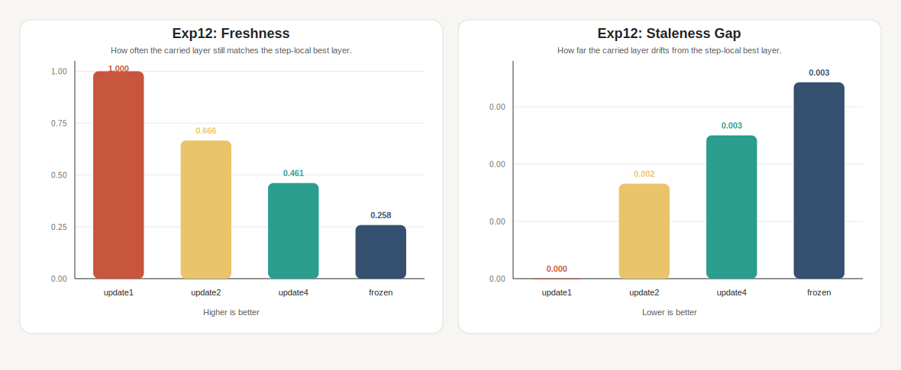

# How `always_contrast` Improves Factuality

## Slide 1: Title

**`always_contrast`: Stronger Contrast With Short-Lived State**

- Goal: improve TruthfulQA factuality without changing model weights
- Model: `Qwen/Qwen2.5-3B-Instruct`
- Decoder of interest: `always_contrast`
- Main result: `always_contrast` beat official DoLa on all three TruthfulQA metrics

## Slide 2: Why Decoder Choice Matters

Even with the same base model, different decoders can produce very different behavior.

In this project, the question is not only:

- which model is better?

It is also:

- which decoding strategy gives more truthful answers
- without becoming too slow to be practical?

That is why decoder choice is a real design decision rather than a minor implementation detail.

## Slide 3: Motivation

Large language models often contain the right knowledge, but the decoded answer can still drift toward:

- common misconceptions
- generic continuations
- easy but false answers
- fluent responses that are not actually grounded

Our starting intuition was simple:

- the model sees the growing answer prefix again at every token
- so repeated re-evaluation may expose weak or premature continuations

This is also broadly consistent with prior work on evaluation-and-refinement style pipelines. The mechanism is not the same as ours, but the broader idea is similar:

- asking the model to re-assess what it is producing can help factuality

Research question:

- can we build a lightweight decoder that repeatedly re-evaluates the growing answer and improves factuality?

## Slide 4: What Makes A Decoder Effective?

For this presentation, we judge a decoder using three practical criteria.

**Truthfulness**

- does it choose more correct and less misleading answers?
- in our evaluator, this is reflected by `mc1`, `mc2`, and `mc3`

**Efficiency**

- does it improve answer quality without too much extra latency?
- we track that with decoding-time latency

**Stability**

- does it behave reliably across many questions rather than winning on only a few lucky examples?
- we want a decoder that is not only strong, but consistently usable

So our working definition is simple:

- an effective decoder improves truthfulness
- stays reasonably efficient
- and remains stable enough to trust in practice

## Slide 5: How We Evaluated This

We compare core decoder families under one shared setup.

- model: `Qwen/Qwen2.5-3B-Instruct`
- benchmark: TruthfulQA multiple-choice subset
- size: `50` examples in the main direct comparison
- main metrics: `mc1`, `mc2`, `mc3`, and latency

The direct comparison includes:

- `pure_greedy`
- `top_k`
- `top_p`
- `dola`
- `always_contrast`
- `panda_switch`

This gives us a clean practical question:

- can `always_contrast` give us better truthful decoding than standard baselines while staying practical?

## Slide 6: Core Intuition

We compare two internal views of the same model:

- final-layer signal: what the mature model currently wants to say
- shallow-layer signal: what an earlier, more premature representation already supports

At every token, the model processes the full current answer prefix again.

If shallow layers over-favor generic or stereotyped answers, then subtracting that shallow preference may help expose the more truthful final-layer preference.

In one sentence:

- factuality may improve when we decode from what survives after premature continuation pressure is discounted
- and when we let that contrast be recomputed as the answer prefix grows

That leads to the next question:

- if we recompute the contrast every token, should we also reselect the correction source from scratch every token?

## Slide 7: Why State Is Needed

Repeated prefix re-evaluation gives the decoder fresh evidence at every token, but it does not by itself say what should be remembered across steps.

Our concern was:

- nearby tokens often belong to the same local continuation pattern
- so changing the correction layer too often can make the contrast signal inconsistent

This is why we add a small amount of state:

- keep a short-lived guess about which shallow layer is currently the best correction source
- refresh that guess periodically instead of rebuilding it from scratch every token

In this presentation, `stateful` means:

- the decoder carries this small memory across past steps
- it does not do future lookahead, beam search, or horizon planning

Related intuition from adaptive transformers:

- when a model makes token-wise routing or early-exit decisions, small local changes can make the chosen path switch too often
- a common fix is to add smoothing, persistence, or reuse decisions across nearby tokens
- our `selected_layer` state plays a similar role: it is a lightweight persistence mechanism for the correction path

## Slide 8: What Official DoLa Does

Official DoLa already uses the same broad contrastive idea:

1. Choose a shallow layer by JSD against the final layer.
2. Build a contrastive score from mature and premature **log-probabilities**.
3. Apply a relative-top filter before decoding.
4. Recompute this decision independently at each token step.

High-level formula:

```text
contrast_scores = log_softmax(final_logits) - log_softmax(shallow_logits)
contrast_scores = log_softmax(contrast_scores)
```

So official DoLa is not just "subtract shallow from final." It is a more constrained log-probability contrast with filtering.

In decoding-time terms:

- official DoLa is prefix-conditioned, but mostly **step-local**
- it re-evaluates each token from scratch rather than carrying a decoder-side belief forward

## Slide 9: What We Changed

Our modification keeps the contrastive idea, but simplifies and strengthens the endpoint:

1. Keep dynamic shallow-layer selection.
2. Decode from a direct binary contrast view:

```text
contrast_scores = final_logits - shallow_logits
```

3. Carry the selected shallow layer statefully and refresh it every `4` token steps.
4. Do not use the official relative-top mask in this path.
5. Re-run the model on the full growing prefix at every step, so each next-token choice is a fresh re-evaluation of the answer-so-far.

This is the `always_contrast` decoder.

So compared with official DoLa, our decoder changes three things that matter most:

- direct logit contrast instead of normalized log-probability contrast
- no relative-top filter in the contrast path
- a small amount of carried state for the correction path

## Slide 10: How `selected_layer` Works

The key extra state in our decoder is `selected_layer`.

We interpret it as a short-lived belief about:

- which shallow layer is currently best exposing the premature or misleading continuation pressure

At a refresh step, the decoder does this:

- take the final-layer token distribution as the mature view
- treat earlier layers as candidate shallow views
- compare each candidate shallow distribution against the final distribution using Jensen-Shannon divergence (JSD)
- choose the shallow layer with the **largest** JSD
- keep that layer for a short span, then refresh it again every `4` token steps

You can think of this as:

- a short-lived, sticky routing decision over shallow layers
- similar in spirit to how adaptive transformers reduce routing instability by avoiding a full re-routing decision at every token

Why might this help?

- a layer with larger JSD is the one that disagrees most strongly with the final layer
- we treat that disagreement as a proxy for premature, generic, or misleading continuation pressure
- subtracting a shallow layer that is too similar to the final layer would remove little useful signal
- reusing the chosen layer briefly can keep the correction signal more consistent across a phrase

## Slide 10A: Why This Changes Token Choice

The important point is that `selected_layer` does not just describe the decoder.

It changes the scoring rule used to rank the next token.

Very roughly:

```text
token_score(v) = final_logits(v) - shallow_logits(selected_layer, v)
```

So if `selected_layer` changes:

- the penalty on each candidate token changes
- the ranking of candidate tokens can change
- the chosen best token can flip

That means the next token can change for two different reasons:

1. the answer prefix genuinely changed
2. the correction layer changed, so the scoring function itself changed

One part of our hypothesis is that official DoLa may suffer from too much of `2`.

In plain language:

- if we keep changing the correction layer every token, we may also keep changing the correction lens every token
- then some token flips may come from decoder-side instability rather than from a genuinely better continuation

This is the intuition behind carrying `selected_layer` briefly:

- use the same correction layer for a short stretch of nearby tokens
- so token selection is driven more by the evolving context
- and less by a noisy layer-selection twitch at every step

## Slide 11: Why The `always_contrast` Package Could Help

Our theory is now centered on the two parts we can support most directly with
matched follow-up evidence.

Compared with official DoLa, `always_contrast` changes three levers, but the
current evidence clearly separates two of them:

1. No relative-top filter
   removing the mask may avoid pruning truthful candidates before the contrast
   signal has a chance to re-rank them.

2. Short-lived `selected_layer` state
   carrying the chosen shallow layer briefly may reduce routing instability
   compared with reselecting from scratch at every token.

3. Direct logit contrast
   this is still part of the implementation, but our matched factorial no
   longer suggests that score space is the main reason the decoder improves.

So the updated working algorithm hypothesis is:

- `always_contrast` improves factuality mainly because it removes the
  relative-top filter and carries `selected_layer` for short spans, producing a
  stronger and more stable correction path than official DoLa.
- the raw-logit score space is still compatible with that package, but it is
  not currently supported as an independent source of gain.

Important caveat:

- `always_contrast` is more stateful than official DoLa
- but it is still not a full revise-and-rewrite decoder
- and it is not beam search or horizon lookahead
- it re-evaluates the growing prefix online without changing already emitted tokens

## Slide 12: Claim Structure

Not every statement needs the same level of proof.

For this talk, the clean structure is:

### Main Algorithm Hypothesis

Compared with official DoLa, `always_contrast` helps because it combines:

- removal of the relative-top filter
- short-lived `selected_layer` persistence

Current evidence does **not** require a separate score-space claim.

### Main Empirical Claim

On this TruthfulQA setup, `always_contrast` improves factuality over official DoLa.

### Robustness Check

The gain should appear consistently across `mc1`, `mc2`, and `mc3`, not only on one metric.

### Design-Space Conclusion

If `always_contrast` beats official DoLa, then official DoLa is not the optimal point in this contrastive design space.

### Component-Level Interpretation

The strongest direct mechanism evidence we have is now for these two
components:

- `exp13` isolates the relative-top decision under matched `update1` decoding
  and shows that removing the filter improves `mc1` and `mc3` in both score
  spaces, while `logprob_no_top` and `logit_no_top` are effectively tied
- `exp12` isolates the persistence schedule directly and shows that carrying
  `selected_layer` briefly can reduce layer thrash without becoming as stale as
  a frozen layer

Important wording:

- the full DoLa comparison supports the package-level claim
- the matched follow-ups directly support the `relative-top` and
  `selected_layer` parts
- we should not overclaim a separate raw-logit benefit from the current data

## Slide 13: Main Result

`always_contrast` is the decoder we want to understand and justify.

In `exp11_core_decoder_comparison` on 50 TruthfulQA examples:

- `always_contrast`: `mc1 = 0.40`, `mc2 = 0.576`, `mc3 = 0.351`, latency `9.76s`
- `dola`: `mc1 = 0.28`, `mc2 = 0.528`, `mc3 = 0.273`, latency `9.53s`

Improvement over official DoLa:

- `+0.12` on `mc1`
- `+0.048` on `mc2`
- `+0.078` on `mc3`

And the latency is nearly the same.

## Slide 14: What The Gain Is Not

Our results suggest the gain is **not** coming from future-horizon search.

- not from beam-search-style horizon search
- not from speculative future-token refinement

Our closest search-like / horizon-style variants were worse. In `exp5` on 30 TruthfulQA examples:

- `always_contrast`: `mc1 = 0.367`, `mc2 = 0.592`, `mc3 = 0.338`
- `panda_switch`: `mc1 = 0.267`, `mc2 = 0.548`, `mc3 = 0.295`
- `panda_always_contrasts`: `mc1 = 0.267`, `mc2 = 0.516`, `mc3 = 0.284`

So the win is more consistent with:

- a stable fixed contrast path
- plus a small amount of carried state

than with adding search or speculative block refinement

## Slide 15: Evidence - State Persistence Tradeoff

`exp12_state_persistence_diagnostics` is the mechanism study for the carried-state hypothesis.

It compares four matched variants that differ only in how often `selected_layer` is refreshed:

- `update1`
- `update2`
- `update4`
- `frozen`

Simpler presentation figures:

- `results/figures/exp12_state_persistence_switch_rate.svg`
- `results/figures/exp12_state_persistence_staleness.svg`
- `results/figures/exp12_state_persistence_quality.svg`


Main reading:

- `update4` cuts switch rate by about `80.5%` versus `update1`
- this is the cleanest single picture for the "less thrash" side of the hypothesis



Main reading:

- `update4` stays clearly fresher than `frozen`
- oracle-match is about `+0.203` higher than `frozen`
- oracle gap is about `27.0%` lower than `frozen`


Main reading:

- `update4` has the strongest `mc2 = 0.576`
- it also ties for the best `mc1 = 0.400`
- so the stability/freshness compromise is not just cosmetic; it also helps quality

Optional summary figure for appendix:

- `results/figures/exp12_state_persistence_hypothesis.svg`

How to read the main mechanism panel:

- `x-axis`: `switch_rate`
  - farther left means less token-level layer flip-flopping
  - in plain language, less `thrash` means the decoder is not changing its mind every token

- `y-axis`: `selected_layer_match_rate`
  - higher means the carried layer still agrees more often with the step-local best layer

- bubble color: `avg_oracle_jsd_gap`
  - cooler means less stale
  - in plain language, less `stale` means the carried layer is less outdated for the current token
  - warmer means the carried layer has drifted farther from the step-local best layer

- bubble size: `mc2`
  - larger means stronger quality on the same run

Short translation of the two main terms:

- `thrash` = changing the correction layer too often
- `stale` = keeping the same correction layer after it has stopped being the best one

What `oracle` means here:

- not ground-truth answer correctness
- it means: if we ignored persistence at this token step and re-checked every shallow candidate right now, which layer would look best under the same JSD rule?

So:

- `oracle_best_layer` = the step-local best shallow layer
- `selected_layer_match_rate` = how often the carried layer still matches that step-local best layer
- `avg_oracle_jsd_gap` = how far the carried layer has drifted from it

The pattern in this experiment is the one the `selected_layer` part of our hypothesis predicts:

- `update1` is very fresh but changes layer too often
- `frozen` is perfectly stable but clearly more outdated
- `update4` is the compromise point: much less jitter than `update1`, but still less stale than `frozen`

On this run:

- `update1`: `switch_rate = 0.692`, `match_rate = 1.000`, `gap = 0.0000`, `mc2 = 0.534`
- `update2`: `switch_rate = 0.323`, `match_rate = 0.666`, `gap = 0.0017`, `mc2 = 0.527`
- `update4`: `switch_rate = 0.135`, `match_rate = 0.461`, `gap = 0.0025`, `mc2 = 0.576`
- `frozen`: `switch_rate = 0.000`, `match_rate = 0.258`, `gap = 0.0034`, `mc2 = 0.560`

The shortest reading is:

- `update4` cuts most of the layer flip-flopping of `update1`
- without becoming as outdated as `frozen`
- and that compromise gives the best `mc2` in the matched persistence study

## Slide 16: Interpretation

Our current interpretation is:

- the important gain is not search or speculative refinement
- the important gain is the `always_contrast` package centered on no
  relative-top filtering and short-lived carried state

Official DoLa already had the right intuition about using shallow-final disagreement.

What our results suggest is that:

- the contrast path helps more when we do **not** apply the relative-top mask
- the decoder becomes less twitchy when it does not re-route the correction layer every token
- the `update4` persistence study is consistent with the second part of that explanation
- the matched `exp13` factorial does not show that replacing log-prob contrast
  with raw-logit contrast is the key driver once filter state is held fixed

## Slide 17: Contribution And Claim

The contribution is best framed as an empirical insight:

- on this TruthfulQA multiple-choice teacher-forced setup, the
  `always_contrast` algorithm substantially improved over official DoLa through
  a decoder change whose best-supported ingredients are removing the
  relative-top filter and briefly carrying the correction layer state

This is not just a tuning result in spirit. It changes the interpretation of where the factuality gain comes from:

- not from sampling randomness
- not from extra search machinery
- but from a contrastive decoder that keeps more candidates alive and avoids
  reselecting the correction layer at every token

**Claim**

For `Qwen/Qwen2.5-3B-Instruct` on TruthfulQA multiple-choice under our evaluator, `always_contrast` is clearly stronger than official DoLa.

## Slide 18: Scope And Final Message

What we can say:

- `always_contrast` improved over official DoLa in this benchmark setting
- the best-supported parts of the design are removing the relative-top filter
  and using short-lived `selected_layer` persistence
- the persistence diagnostic gives direct support for the `selected_layer` part
  of the story
- the matched factorial gives direct support for the relative-top part of the
  story

What we should not overclaim:

- universal superiority across all models
- universal superiority across all factuality datasets
- a complete mechanistic proof that raw-logit score space adds independent
  value in this setting

If we had to summarize the whole project in one line:

- `always_contrast` improved factuality here by removing the relative-top
  filter and briefly carrying the selected correction layer.
